## Folder Redirection
This section implements Folder Redirection for the Marketing (Verkoop) department.
The goal is to centrally store user data while maintaining performance, security, and privacy.

Context : 

A "Documents" and "Pictures" user folder per person in the verkoop/marketing department must be redirected to the file server. 

This ensures that:
- Data is stored centrally on the server

- Users don't have access to each other's data

- The solution is efficient and does not overload the network.

---
**AGDLP:**

## Account: 

Ou_Verkoop with the accounts is there already. 

## GLOBAL SECURITY GROUPS + DOMAIN LOCAL GROUPS

Here we make the Global Security Group "GG_verkoop" and 
The Domain Local group "DL_Verkoop_Folder_Redirect_Modify"

 

## Permissions 
First, we make the folder_redirect file in the file server
Then, as you can see below, we make sure the shared permissions is "full control"
 

In the NTFS permissions, we remove the inherited permissions and the unwanted groups or users with access. 
Then we modify the access of the requested group: 

 

Next, I am making sure the share is hidden by going to "Advanced Sharing..." and adding a **dollar sign $** after the name.

 

I redid the shared permissions because they reset, so in the future, this step will be done first.

## GPO 

If you do the test now, someone from another department still sees an "E-folder". 
In this step, we will be implementing the group policy. 

Tools --> Group Policy Management --> Group Policy Objects. 

On "Group Policy Objects" Right Mouse Click --> New --> .... file in the name and "OK"

 

After that, you do RMK and "edit" 

Here you get 2 options ; we will be configuring it on user level so "User configuration"

Here you navigate to "Folder Redirection" ; then you RMK Documents --> properties --> "Basic -redirect everyone's folder to the same location"

 

Next, we add the file path 
Because it is a hidden share, we have to look up the file, and we can directly copy past the file path in the requested location.  ( because it is a hidden share)
don't forget the **$** 

 

"Create a folder for each user..." --> as you can see above "ok" , "cancel"  ... we get an example of what we want. 

Click "OK" --> warning do you want to coninue ... click "yes"

We can easily "follow the document folder" to get the same result for the pictures 

 

Again "ok" and "Yes"

Now lets apply this to "verkoop" , we can easily do this by dragging and ropping the GPO to the OU_verkoop : 

 

Lets try with Anna Scott (anna.scott) from verkoop/marketing

After having logged-in and having added a document and image.
we can already see in the file path that it works and is stored in a central location on the network.

 

Initially, access to the share did not work because the users were not part of the correct security groups.

We solved this by implementing the AGDLP model:
- Users were added to Global Groups (GG_Verkoop) --> this was the step I missed, not only do the users need to be created in the OU but also added to the Global Group by selecting them all in the OU and adding them. 
- Global Groups were added to Domain Local Groups
- Domain Local Groups were assigned NTFS permissions on the shared folder

---

## Network Connectivity / Network Drive Mapping via GPO

In our previous Lab2, we configured a file share (file server).
We will build on this to make sure users can access shared network files. 

**scenario:**

We will test this with users from Boekhouding and give access to the following shared folders:

\\FS1\03_Boekhouding
\\FS1\02_Administratie

*1. new GPO*
   
Open Group Policy Management in DC

Server Manager → Tools → Group Policy Management 

RMK on "Group Policy Objects" and click new to create a new GPO
Because we are working with OU's we are going to make one policy for the "boekhouding" and "administatie" folders as this is what the Bookkeeping department needs. 

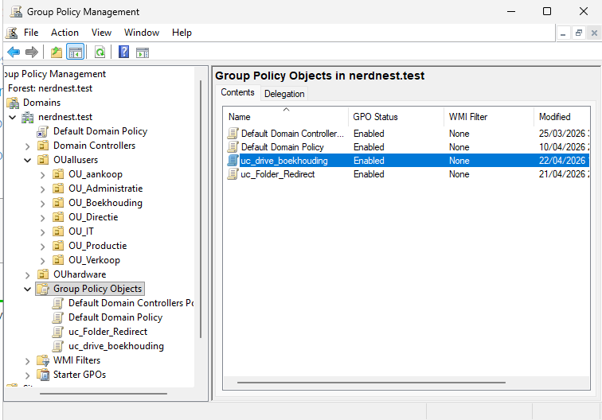 

*2. Edit the GPO + Creating Drive Mappings*

RNK on the policy and click "Edit"

We go to "User configuration" --> Preferences --> Windows Settings --> Drive Maps 

In Drive maps RMK --> New -->  mapped drive 

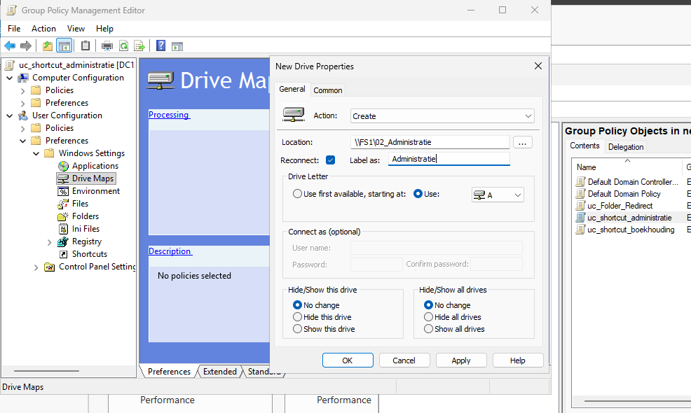  

We create two mapped drives:

- Administratie share :
Action: Create
Location: \\FS1\02_Administratie
Drive Letter: A:
Reconnect: Enabled

- Boekhouding share :
Action: Create
Location: \\FS1\03_Boekhouding
Drive Letter: B:
Reconnect: Enabled

*3. Link the GPO to the OU*

Drag the policy to the Ou to which it applies 

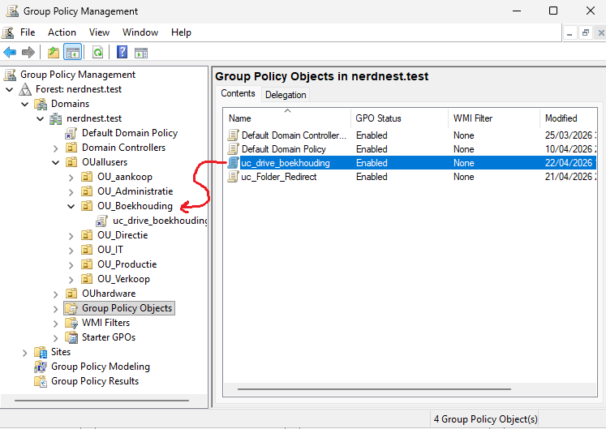  

*4. Test on client*

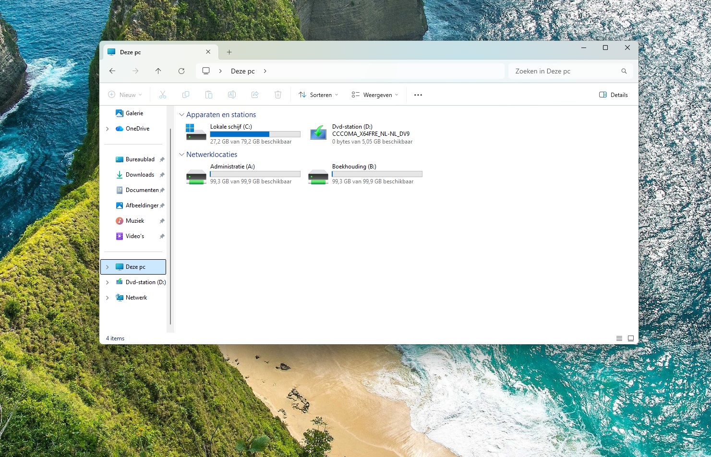  

Mapped network drives appear under "This PC" because Windows treats them as local drives, making access to network resources more intuitive for users.

## GPO_background 

The next goal is to configure a Group Policy to automatically set a desktop background for all domain users.

This is done by first following AGDLP

First we make the Global groups , they should all be there 
Then we make the domain local group "DL_wallpaper_R" which will be used to give reading rights only and we add all the global groups as you can see below : 

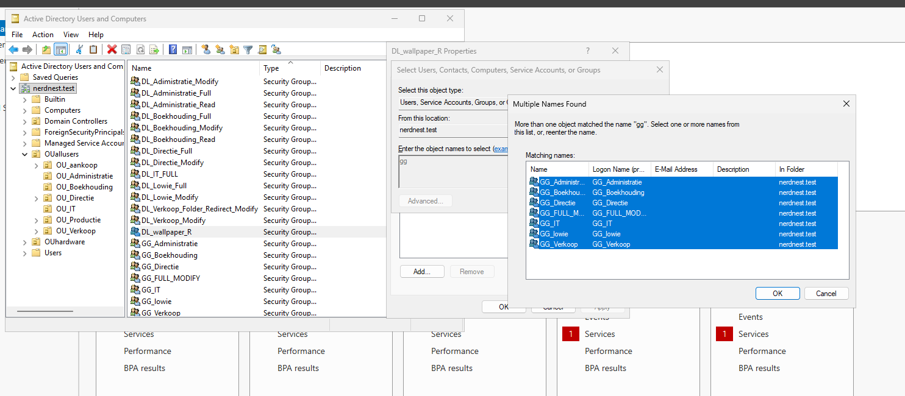   

Now the last step the Permissions : 

- shared permision :
  First we make it a secret folder in advanced sharing with the $ and then we give full permission
  NOTE : if you don't add the **$** in this step you have to redo.
  
- NTFS (security) :
  advanced --> disable inheritance --> convert inherited permissions ... ( top option)

  Edit --> DL_wallpaper_R --> we keep things on standard reading rights 

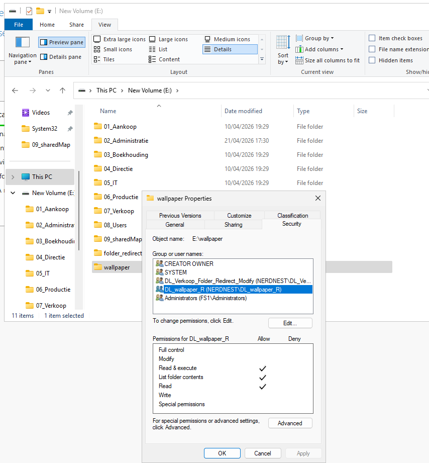   

in the DC we test the hidden file : \\FS1\wallpaper$ --> this file path we will also use... 

**Next step: MAKING A POLICY**

Tools --> Group Policy Management --> Group Policy Object (to make a new policy) --> New --> "Name :uc_wallpaper" --> edit

In Edit : User Configuration --> Policies --> Administrative Templates --> Desktop --> Desktop --> Desktop Wallpaper --> Enable 

Here we make sure the block is Enabled, and we are going to use the UNC path \ the name of the image 

So you get : \\FS1\wallpaper$\company_wallpaper.jpg

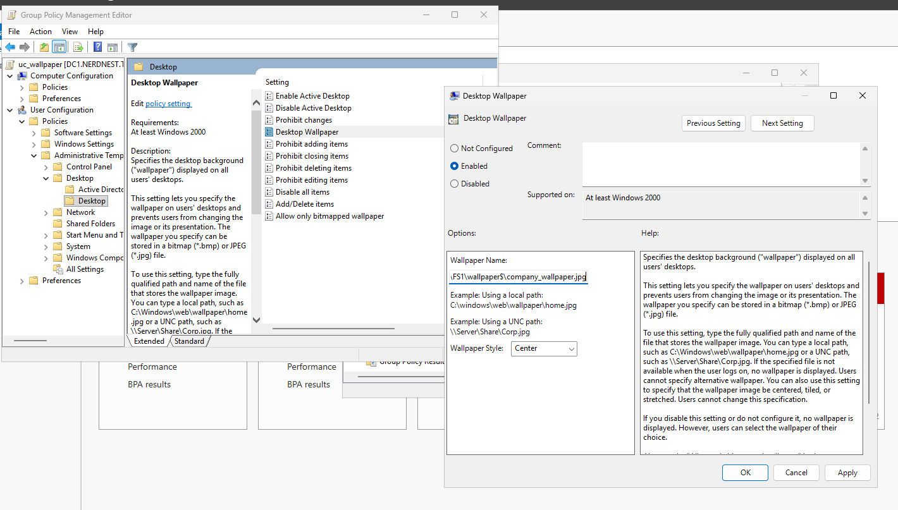   

The final step is to drag the policy to all the OU's it applies to. 

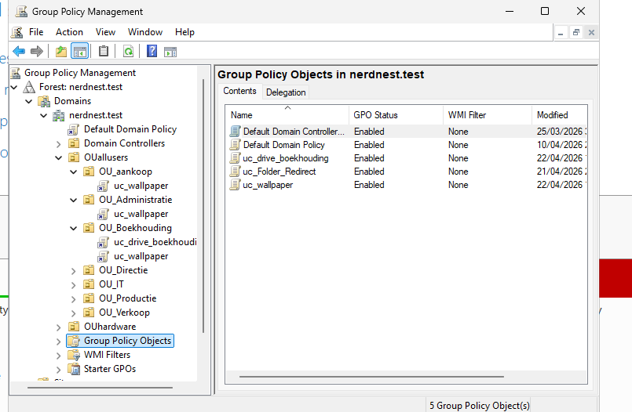   
 

**testing:**
In powershell you can see which policies are active (not CMD , will give an error). 

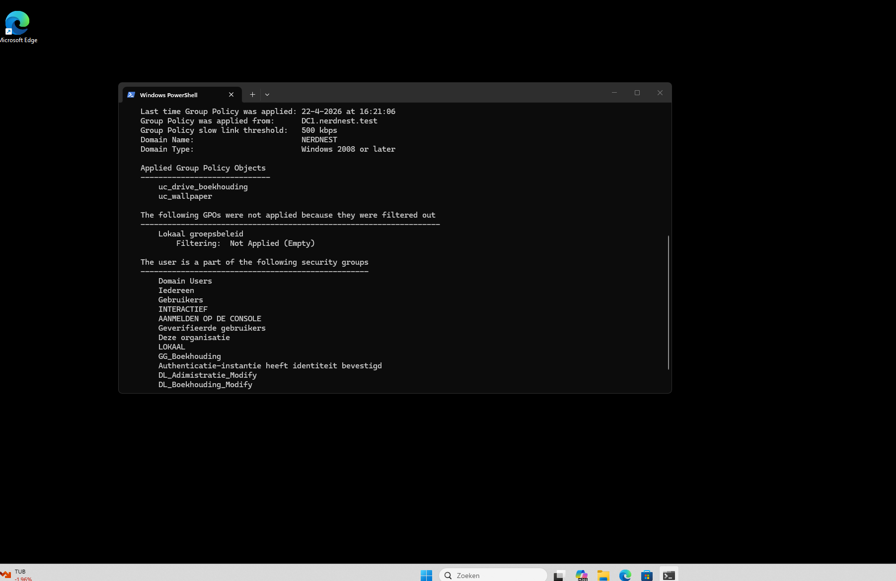   

The background is black because the selected image wasn't suitable, but the policy is enforced correctly. 

## IT-department - Local Administrator Rights

In this section, we configure a solution where IT users receive local administrative privileges on their workstations, without granting domain-wide administrative rights.

Scenario

All users in the IT department must:

- Have full administrative control over their local machine
- Not have administrative rights over the domain

To do this, we are going to work **similar** to AGDLP : 

The IT-OU and accounts are already made and added to the a global group
Next, we are going to make a new Domain Local security group to enforce this policy on  

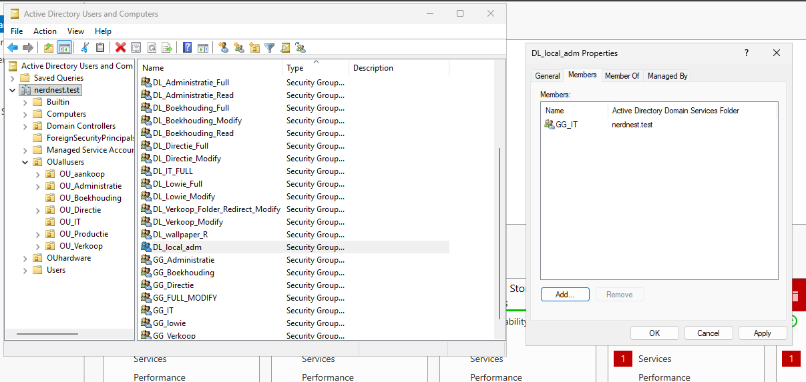   

Make sure that the Global IT group is part of the DL with the policy

**Configure Local Administrator Rights via GPO**

To apply the permissions, we configure a Group Policy that adds the domain local group to the local Administrators group on client machines.

Tools --> Group Policy Management --> New --> "Name: uc_local_admin_it" --> Edit 

In Edit : Computer Configuration → Preferences → Control Panel Settings → Local Users and Groups

   

In "Local Users and Groups" RMK --> Mew --> Local Group 
Action     = Update         
Group name = Administrators 

**Add...** --> next to name click **...** --> here you can use the prefix DL and check for "DL_local_adm"

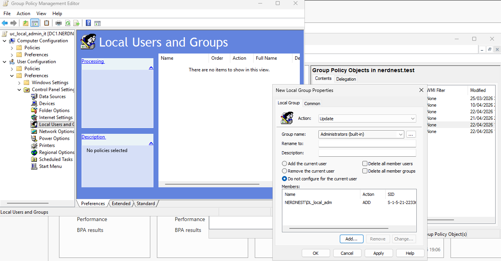   

This GPO adds the domain local group : "DL_local_adm" to the local admin group for all the IT-clients 

Next in the main "Group Policy Management" screen drag "uc_local_admin_it" to apply it 

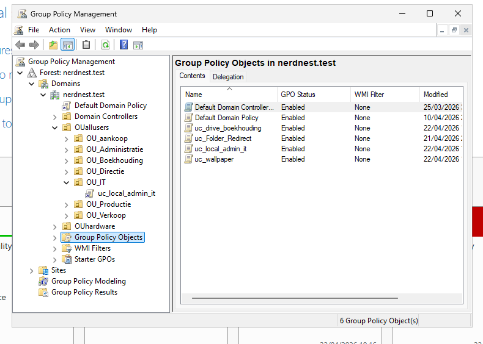   

**TO TEST:**

we will login with "andrew.gray" from the OU_IT

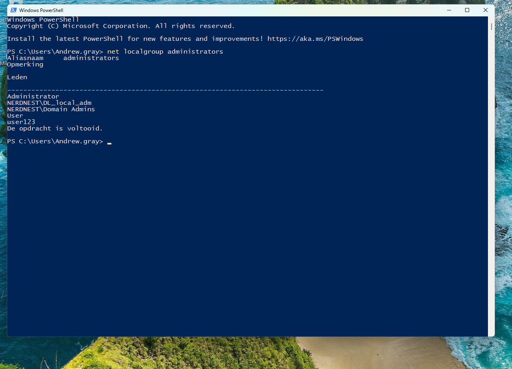   

This confirms that the Group Policy was successfully applied, as the domain local group is now part of the local Administrators group.

## MSI DEPLOYMENT

The goal is to configure automatic software deployment using Group Policy, to install VLC Media Player.

This will be applied to the OU_IT.
The installation is performed automatically using an .msi package.

### 1. Download & prepare MSI
- Download VLC Media Player in the **.msi format** (not .exe)
- Place the file in the shared SYSVOL location:
  
  \\dc1\sysvol\nerdnest.test\Policies\Software\VLC\

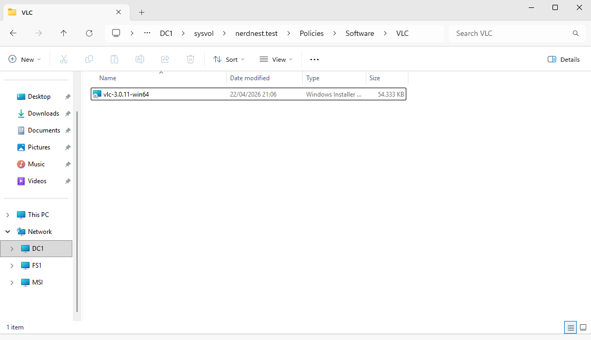   

If you want to test the file path you can copy past it in run and see if it opens the file in the file location. 
  
### 2. Create GPO

- First, I am going to create a DL group to which to apply the policy directly to : 

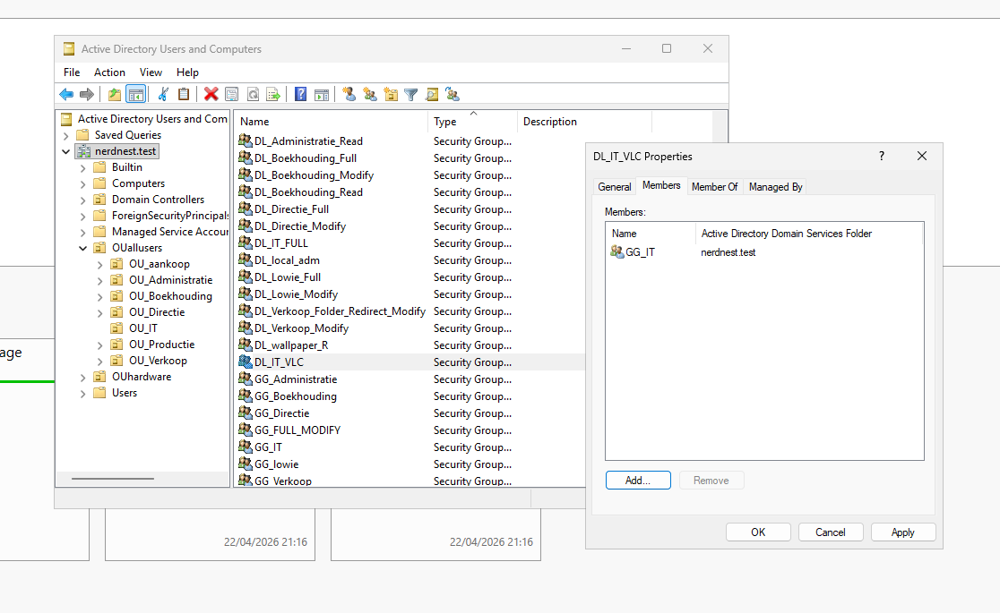 

- Create a new Group Policy Object :

Tools --> Group Policy Management --> Group policy Object --> RMK --> New --> "Name: cc_software_vlc_it " --> Edit 

In Edit : Computer Configuration --> Policies --> Software Settings --> Software installed --> New --> Package...

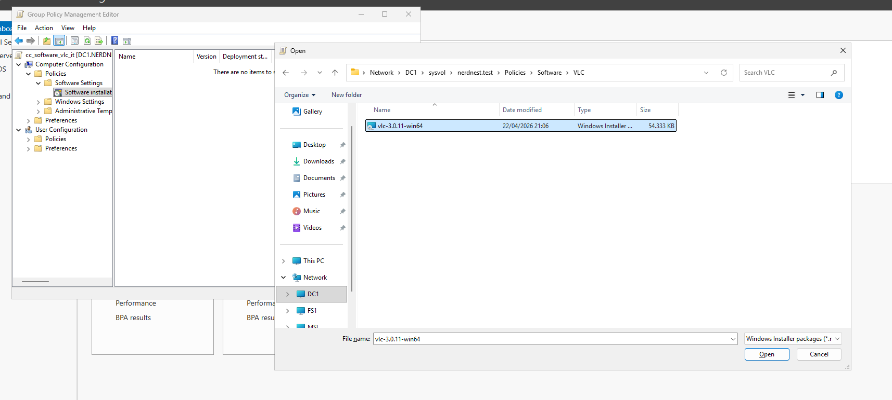 

Deploy Software --> Select Assigned 

- Link the GPO to the **OU_IT**

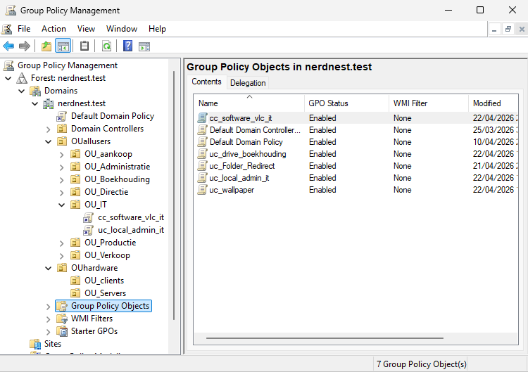 

### 3. Test
---
**IMPORTANT !!!!

The policy is focused on computer configuration this time so it should be linked to my client 1 not the account of the IT person  

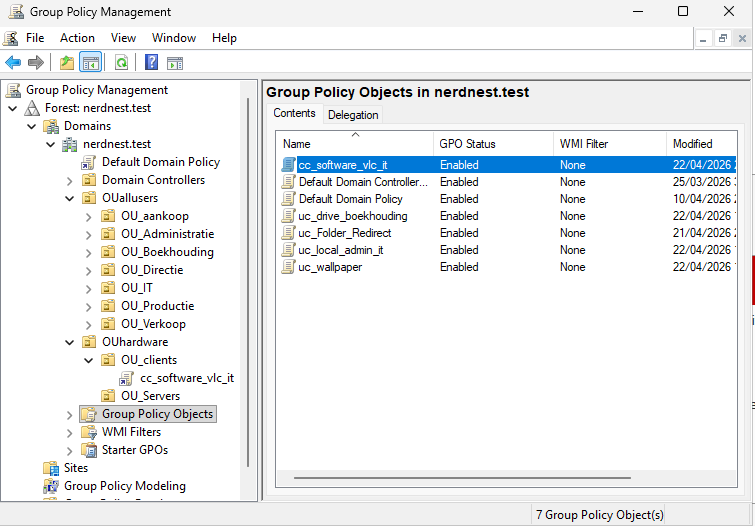 

---
- Run on the client:

  gpupdate /force

- Restart the client machine :
shutdown /r /t 0 
- VLC should install automatically during startup --> appwiz.cpl

final part did not work, need more debugging to find issue. 
