## Folder Redirection
This section implements Folder Redirection for the Marketing (Verkoop) department.
The goal is to centrally store user data while maintaining performance, security, and privacy.

Context : 

A "Documents" and "Pictures" user folder per person in the verkoop/marketing department must be redirected to the file server. 

This ensures that:
- Data is stored centrally on the server

- Users don't have access to each other's data

- The solution is efficient and does not overload the network.

---
**AGDLP:**

## Account: 

Ou_Verkoop with the accounts is there already. 

## GLOBAL SECURITY GROUPS + DOMAIN LOCAL GROUPS

Here we make the Global Security Group "GG_verkoop" and 
The Domain Local group "DL_Verkoop_Folder_Redirect_Modify"

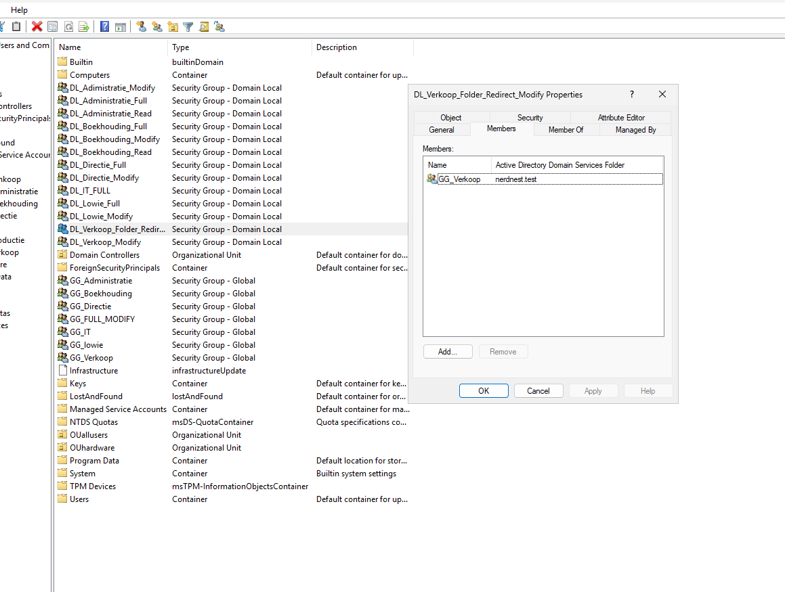 

## Permissions 
First, we make the folder_redirect file in the file server
Then, as you can see below, we make sure the shared permissions is "full control"
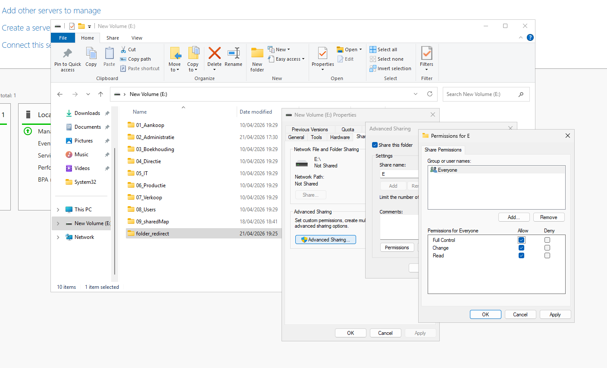 

In the NTFS permissions, we remove the inherited permissions and the unwanted groups or users with access. 
Then we modify the access of the requested group: 

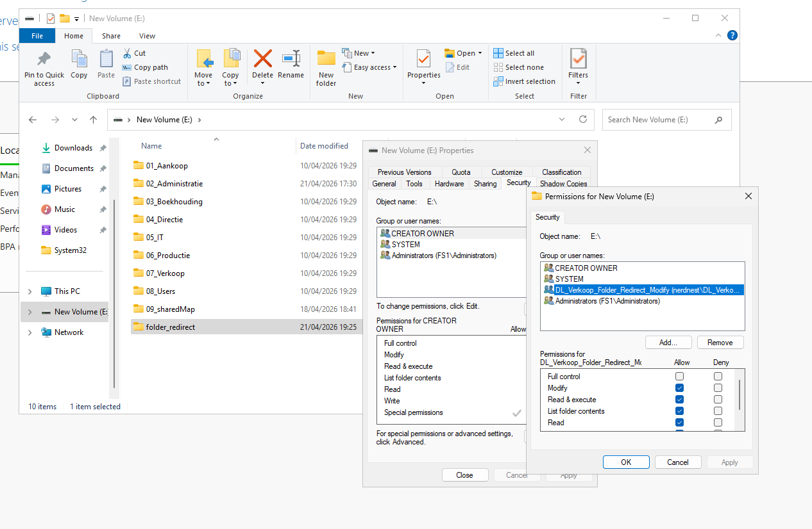 

Next, I am making sure the share is hidden by going to "Advanced Sharing..." and adding a **dollar sign $** after the name.

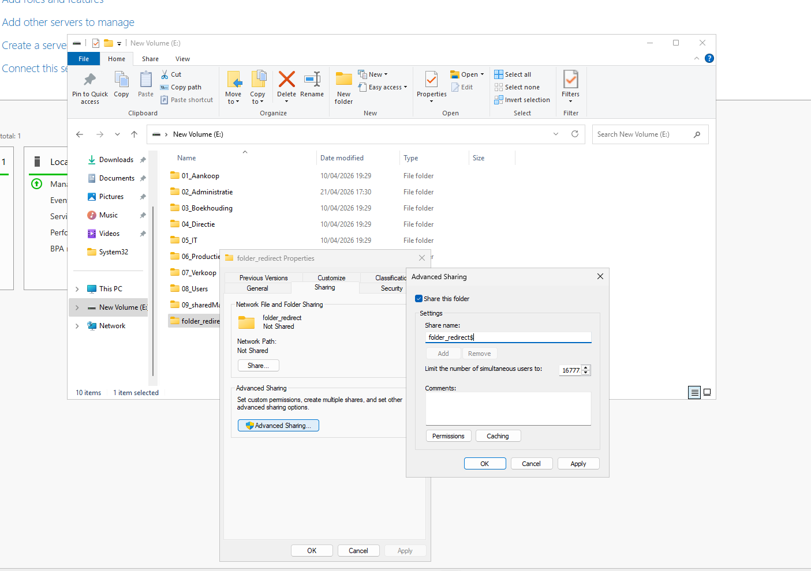 

I redid the shared permissions because they reset, so in the future, this step will be done first.

## GPO 

If you do the test now, someone from another department still sees an "E-folder". 
In this step, we will be implementing the group policy. 

Tools --> Group Policy Management --> Group Policy Objects. 

On "Group Policy Objects" Right Mouse Click --> New --> .... file in the name and "OK"

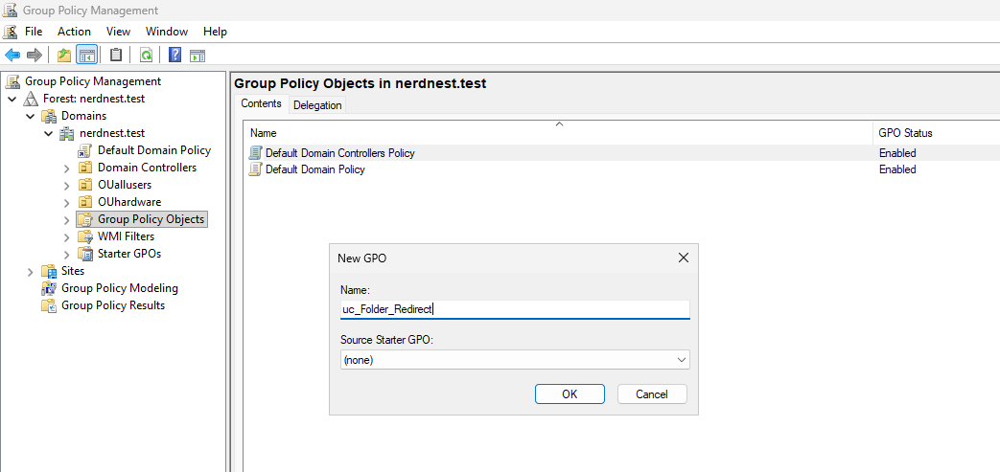 

After that, you do RMK and "edit" 

Here you get 2 options ; we will be configuring it on user level so "User configuration"

Here you navigate to "Folder Redirection" ; then you RMK Documents --> properties --> "Basic -redirect everyone's folder to the same location"

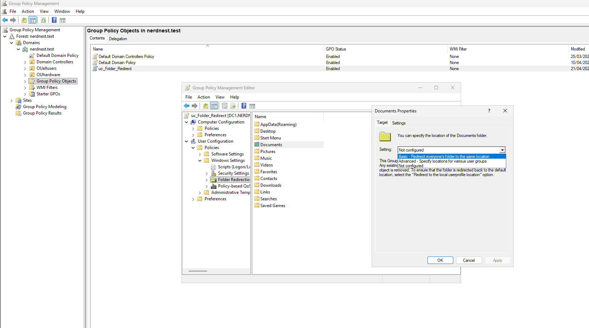 

Next, we add the file path 
Because it is a hidden share, we have to look up the file, and we can directly copy past the file path in the requested location.  ( because it is a hidden share)
don't forget the **$** 

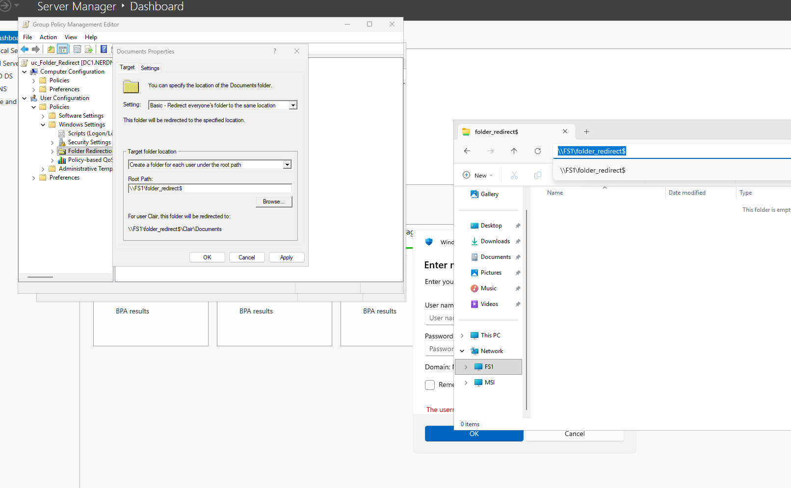 

"Create a folder for each user..." --> as you can see above "ok" , "cancel"  ... we get an example of what we want. 

Click "OK" --> warning do you want to coninue ... click "yes"

We can easily "follow the document folder" to get the same result for the pictures 

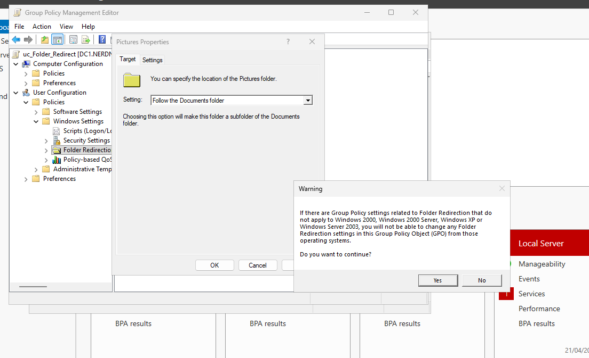 

Again "ok" and "Yes"

Now lets apply this to "verkoop" , we can easily do this by dragging and ropping the GPO to the OU_verkoop : 

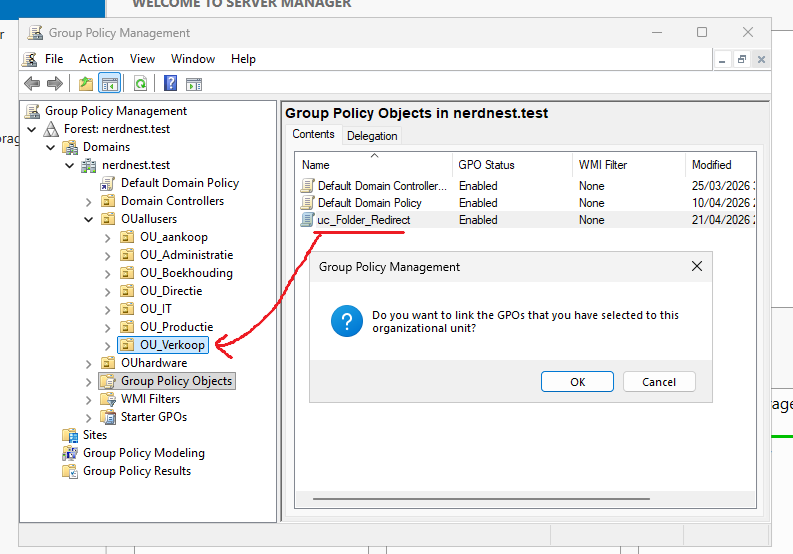 

Lets try with Anna Scott (anna.scott) from verkoop/marketing

After having logged-in and having added a document and image.
we can already see in the file path that it works and is stored in a central location on the network.

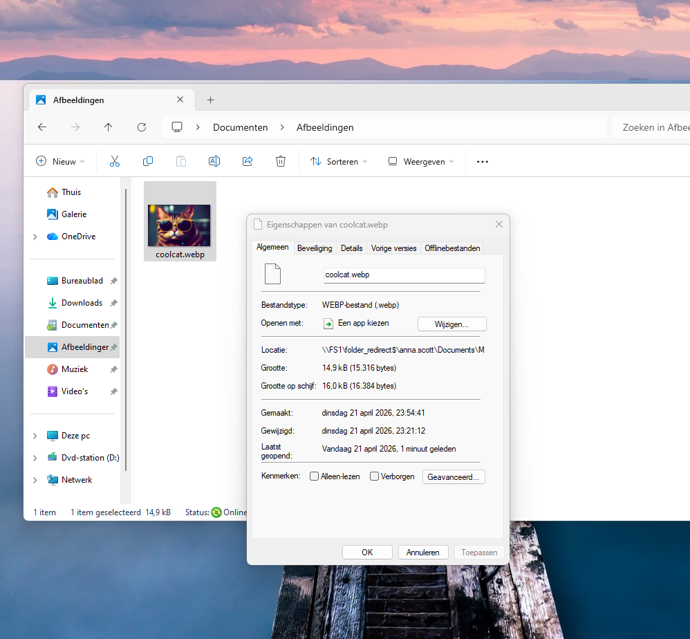 

Initially, access to the share did not work because the users were not part of the correct security groups.

We solved this by implementing the AGDLP model:
- Users were added to Global Groups (GG_Verkoop) --> this was the step I missed, not only do the users need to be created in the OU but also added to the Global Group by selecting them all in the OU and adding them. 
- Global Groups were added to Domain Local Groups
- Domain Local Groups were assigned NTFS permissions on the shared folder

---

## Network Connectivity
In our previous lab2 we configured a file share. (file server). 
We will build on this to make sure users can access shared network files. 

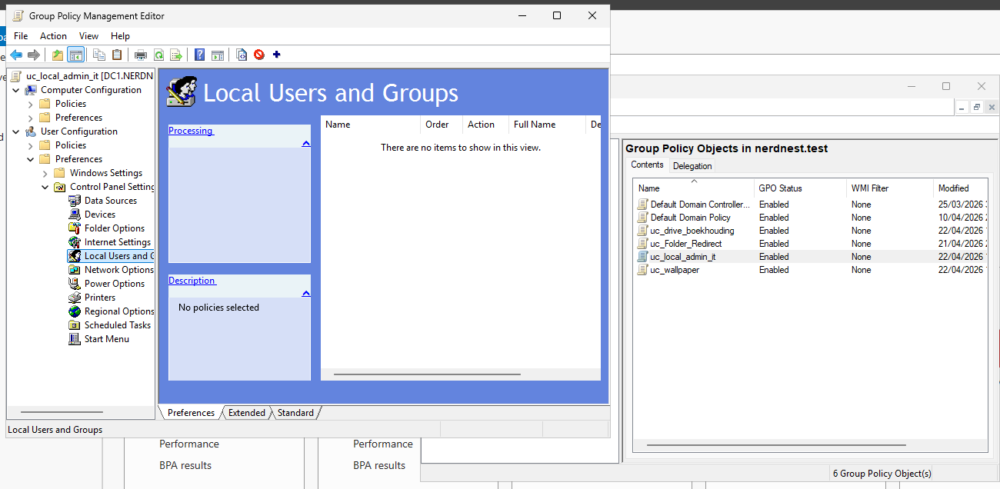 
